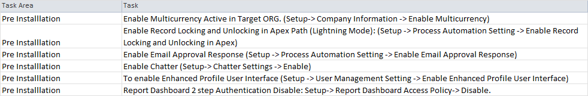
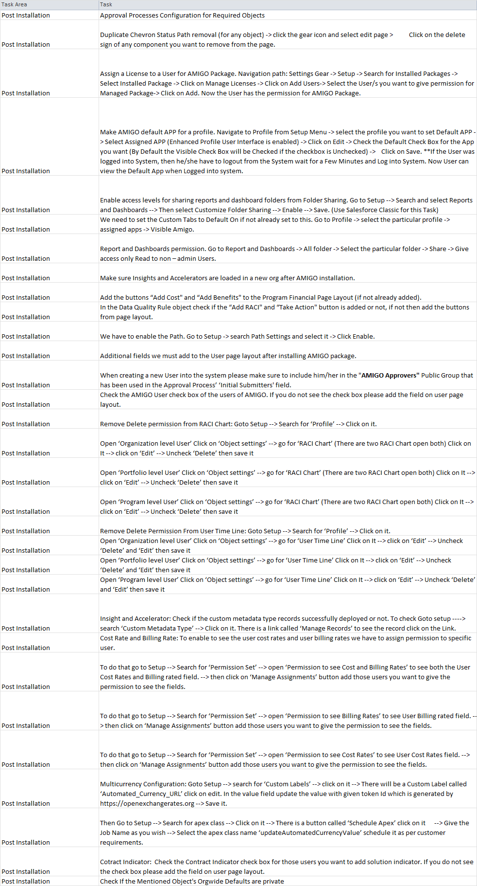

# 📖 Introduction to AMIGO

> **AMIGO** - AI Managed Implementation Governance Office

---

## 🎯 What is AMIGO?

AMIGO is a comprehensive Salesforce-based program and project management platform designed for enterprise digital transformations. Built by Platinum PMO, AMIGO provides unparalleled optics, interactivity, and management capabilities from the program level down to individual work packages.

### Key Differentiators

- **Granular Control**: Manage work down to the work package level with full traceability
- **RACI Integration**: Responsibility assignment matrix built into every element
- **AI Messenger**: Intelligent notifications that connect teams across the program
- **Methodology Agnostic**: Support for any implementation methodology
- **Reusable Test Library**: Build once, test many times across the program lifecycle

---

## 👥 Target Audience

This documentation is designed for:

| Role | Use Case |
|------|----------|
| **Administrators** | Platform setup, user management, and configuration |
| **Program Leaders** | Strategic oversight and governance |
| **Project Managers** | Day-to-day project execution and tracking |
| **Team Members** | Work package execution and collaboration |
| **Consultants** | Solution integration and methodology implementation |

---

## 🚀 Getting Started

### For Administrators

#### Pre-Installation Tasks



#### Post-Installation Tasks



### For All Users

1. **Log into Salesforce** and navigate to the AMIGO application
2. **Explore the Road Map** to understand the platform structure
3. **Set up My Favorites** for quick access to frequently used objects
4. **Configure Notifications** to receive relevant updates

---

## 🧭 Navigating AMIGO

### AMIGO Utility Bar

The utility bar provides quick access to common functions and navigation elements.

### Road Map

The Road Map is your primary navigation tool for exploring AMIGO's capabilities.


### My Favorites

Bookmark frequently used objects for quick access across any device or browser.


### Custom User Notifications

Configure your notification preferences to stay informed about relevant changes.


---

## 📱 Navigation Options

AMIGO provides multiple ways to navigate and view your data:

| View Type | Description |
|-----------|-------------|
| **Tab Selection** | Access object record lists via tabs |
| **Kanban View** | Visual board for monitoring work progress |
| **Table View** | Spreadsheet-style data display with sorting |
| **Lists & Details** | Quick filtering and segmentation of records |

---

## 🏗️ Platform Architecture

AMIGO is built around an integrated core with the following major components:

```text
Organization → Portfolio → Program → Project → Deliverable → Work Package
                              ↓
                    ┌─────────┴─────────┐
                    │   Integrated Core │
                    ├───────────────────┤
                    │ • Organization    │
                    │ • People          │
                    │ • Process         │
                    │ • Technology      │
                    │ • Data            │
                    │ • Governance      │
                    └───────────────────┘
```

---

## 📚 Documentation Structure

This wiki is organized around the AMIGO Road Map:

| Section | Description |
|---------|-------------|
| [Organization](https://platinum-pmo-llc.github.io/amigo-wiki/Organization-(Road-Map)) | Hierarchy and portfolio management |
| [People](https://platinum-pmo-llc.github.io/amigo-wiki/People) | Users, roles, and stakeholder management |
| [Process](https://platinum-pmo-llc.github.io/amigo-wiki/Process) | Business processes and methodology |
| [Technology](https://platinum-pmo-llc.github.io/amigo-wiki/Technology) | Systems and environments |
| [Data](https://platinum-pmo-llc.github.io/amigo-wiki/Data) | Data management and migration |
| [Governance](https://platinum-pmo-llc.github.io/amigo-wiki/Governance) | RAID management and controls |
| [Scope Management](https://platinum-pmo-llc.github.io/amigo-wiki/Scope-Management) | Programs, projects, deliverables |
| [Value Management](https://platinum-pmo-llc.github.io/amigo-wiki/Value-Management) | Goals, benefits, and costs |
| [Testing](https://platinum-pmo-llc.github.io/amigo-wiki/Testing) | Test library and defect management |
| [Operational Readiness](https://platinum-pmo-llc.github.io/amigo-wiki/Operational-Readiness) | Cutover planning |
| [Time & Expense](https://platinum-pmo-llc.github.io/amigo-wiki/Time-and-Expense) | Time and expense tracking |
| [Reports & Dashboards](https://platinum-pmo-llc.github.io/amigo-wiki/Report-and-Dashboard) | Reporting and analytics |

---

## 🔗 Quick Links

- [Quick Start Guide](https://platinum-pmo-llc.github.io/amigo-wiki/Quick-Start-Guide) - Get started in 5 minutes
- [FAQ](https://platinum-pmo-llc.github.io/amigo-wiki/FAQ) - Frequently asked questions
- [Glossary](https://platinum-pmo-llc.github.io/amigo-wiki/Glossary) - Key terms and definitions
- [AMIGO Planner](https://amigo.my.salesforce.com) - Access Salesforce

---

## 📞 Support

For support and feedback:

- Follow us on [Twitter](https://twitter.com/platinumpmo)
- Connect on [LinkedIn](https://www.linkedin.com/company/platinumpmo/mycompany/)

---

*© Platinum PMO LLC. All rights reserved.*
