# BELDEN Domain Context Unified Relationship Documentation

## AI-Powered Query Generation Reference for AMIGO Platform

---

| Document Information | Details |
|---------------------|---------|
| **Document Owner** | WBE Consultants LLC |
| **Development Partner** | Platinum Consulting & IT Solutions Pvt Ltd |
| **Version** | 1.0 |
| **Date** | January 2026 |
| **Total Domain Contexts** | 15 Domains |
| **Total Objects** | 147 Salesforce Objects (146 Custom + 1 Standard) |
| **AI Agent** | BELDEN |
| **Platform** | AMIGO (AI Managed Implementation Governance Office) |

---

## Table of Contents

1. [Executive Summary](#1-executive-summary)
2. [Master Entity Relationship Diagram](#2-master-entity-relationship-diagram)
3. [Domain Context Details](#3-domain-context-details)
   - [DC-01: Organization & Portfolio Management](#dc-01-organization--portfolio-management)
   - [DC-02: Program Management](#dc-02-program-management)
   - [DC-03 & DC-04: Project, Deliverable & Work Package Management](#dc-03--dc-04-project-deliverable--work-package-management)
   - [DC-05: Risk, Issue & Decision Management (RAID)](#dc-05-risk-issue--decision-management-raid)
   - [DC-06: Action & Change Management](#dc-06-action--change-management)
   - [DC-07: Resource & RACI Management](#dc-07-resource--raci-management)
   - [DC-08: Work Stream & Methodology](#dc-08-work-stream--methodology)
   - [DC-09: Business Process & Job Role Management](#dc-09-business-process--job-role-management)
   - [DC-10: Data Management & Migration](#dc-10-data-management--migration)
   - [DC-11: Testing & Quality Management](#dc-11-testing--quality-management)
   - [DC-12: Cutover & Go-Live Management](#dc-12-cutover--go-live-management)
   - [DC-13: Benefits & Financial Tracking](#dc-13-benefits--financial-tracking)
   - [DC-14: Communication & Collaboration](#dc-14-communication--collaboration)
4. [Cross-Domain Relationship Matrix](#4-cross-domain-relationship-matrix)
5. [Query Generation Guidelines](#5-query-generation-guidelines)
6. [Appendix: Complete Object Reference](#6-appendix-complete-object-reference)

---

## 1. Executive Summary

This document provides a unified view of all object relationships across the AMIGO platform, organized by Domain Context. BELDEN uses these relationships to:

- **Generate accurate SOQL/SOSL queries** by understanding object hierarchies
- **Traverse parent-child relationships** for complex analytical queries
- **Map user questions** to the correct domain and objects
- **Optimize query performance** by selecting the right relationship paths

### Core Hierarchy Principle

All AMIGO objects follow a strict organizational hierarchy:

```
Organization → Portfolio → Program → Project → Deliverable → Work Package
```

This hierarchy is **mandatory** and most objects have lookup relationships to one or more levels of this hierarchy.

### Standard Object Reference

The only standard Salesforce object with direct relationships in AMIGO is:

| Standard Object | API Name | Purpose |
|----------------|----------|---------|
| **User** | `User` | Links to Resources, RACI Charts, End Users, and all user associations |

---

## 2. Master Entity Relationship Diagram

This diagram shows the high-level relationships between the core AMIGO objects across all domains.

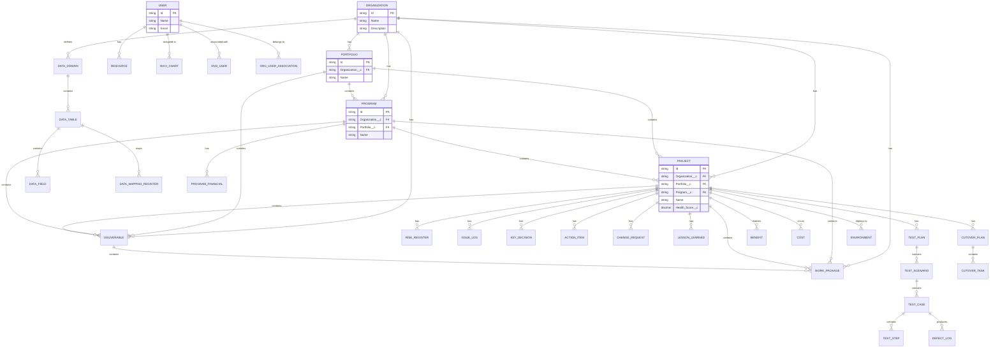

---

## 3. Domain Context Details

### DC-01: Organization & Portfolio Management

**Priority:** High | **Objects:** 9 | **Trigger Keywords:** portfolio, organization, goals, objectives, metrics, allocate, budget, investment

#### Objects in This Domain

| API Name | Label | Description |
|----------|-------|-------------|
| `amigo1__Organization__c` | Organization | Top-level entity representing company/business unit |
| `amigo1__Portfolio__c` | Portfolio | Collection of related programs |
| `amigo1__Portfolio_Evaluation_Request__c` | Portfolio Evaluation Request | Request for portfolio assessment |
| `amigo1__Portfolio_User_Association__c` | Portfolio User Association | Links users to portfolios |
| `amigo1__Portfolio_Evaluator__c` | Portfolio Evaluator | Users who evaluate portfolios |
| `amigo1__User_Association__c` | Organization User Association | Links users to organizations |
| `amigo1__Goals__c` | Goals | Strategic goals at org/portfolio/program/project level |
| `amigo1__Objectives__c` | Objectives | Objectives linked to goals |
| `amigo1__Measures_and_Metrics__c` | Measures and Metrics | KPIs tracking objective achievement |

#### Relationship Diagram

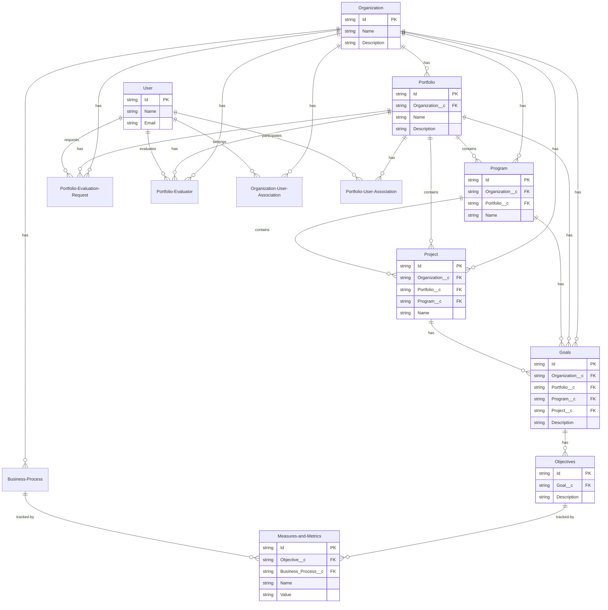

#### Sample Questions for This Domain

| Question | Required Objects | Query Pattern |
|----------|-----------------|---------------|
| "What are our organizational goals?" | Goals, Organization | `SELECT Id, Name FROM amigo1__Goals__c WHERE amigo1__Organization__c = :orgId` |
| "How should I allocate budget across portfolios?" | Portfolio, Program, Project | `SELECT Id, Name, amigo1__Budget__c FROM amigo1__Portfolio__c WHERE amigo1__Organization__c = :orgId` |
| "Who are the portfolio evaluators?" | Portfolio_Evaluator, User | `SELECT Id, amigo1__User__r.Name FROM amigo1__Portfolio_Evaluator__c` |

---

### DC-02: Program Management

**Priority:** High | **Objects:** 7 | **Trigger Keywords:** program, financial, evaluation, score, domain

#### Objects in This Domain

| API Name | Label | Description |
|----------|-------|-------------|
| `amigo1__Program__c` | Program | Group of related projects |
| `amigo1__Program_Financial__c` | Program Financial | Financial tracking for programs |
| `amigo1__Program_User_Association__c` | Program User Association | Links users to programs |
| `amigo1__Program_Dictionary__c` | Program Dictionary | Term definitions for the program |
| `amigo1__Program_Evaluation_Score__c` | Program Evaluation Score | Evaluation scores for programs |
| `amigo1__Domain_Program__c` | Domain Program | Domain-program associations |
| `amigo1__Datum_Program__c` | Datum Program | Data-program associations |

#### Relationship Diagram

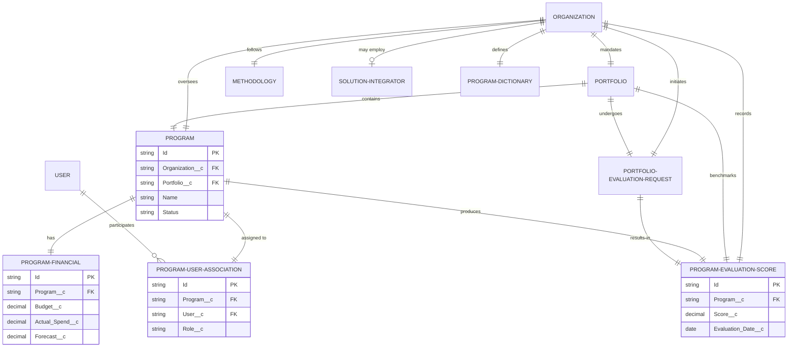

#### Sample Questions for This Domain

| Question | Required Objects | Query Pattern |
|----------|-----------------|---------------|
| "How is Program X performing financially?" | Program, Program_Financial | `SELECT Id, Name, (SELECT amigo1__Budget__c, amigo1__Actual_Spend__c FROM amigo1__Program_Financials__r) FROM amigo1__Program__c WHERE Name LIKE '%X%'` |
| "Who is assigned to Program Y?" | Program, Program_User_Association, User | `SELECT amigo1__User__r.Name, amigo1__Role__c FROM amigo1__Program_User_Association__c WHERE amigo1__Program__r.Name LIKE '%Y%'` |
| "What is the evaluation score for our programs?" | Program_Evaluation_Score | `SELECT amigo1__Program__r.Name, amigo1__Score__c FROM amigo1__Program_Evaluation_Score__c` |

---

### DC-03 & DC-04: Project, Deliverable & Work Package Management

**Priority:** High | **Objects:** 15 | **Trigger Keywords:** project, deliverable, work package, task, team, gate, methodology, activity, health, status, estimate

#### Objects in This Domain

| API Name | Label | Description |
|----------|-------|-------------|
| `amigo1__Project__c` | Project | Individual implementation initiative |
| `amigo1__Project_Dictonary__c` | Project Dictionary | Term definitions for the project |
| `amigo1__Project_Teams__c` | Project Team | Team assignments for projects |
| `amigo1__Project_End_User__c` | Project End User | End users associated with projects |
| `amigo1__Project_Methodology_Activity__c` | Project Methodology Activity | Methodology activities for projects |
| `amigo1__Project_Key_Decision__c` | Project Key Decision | Key decisions for projects |
| `amigo1__Gate__c` | Gate | Phase gate checkpoints |
| `amigo1__Gate_Metrics_and_Results__c` | Gate Metrics and Results | Gate evaluation results |
| `amigo1__Deliverable__c` | Deliverable | Major project outputs |
| `amigo1__Deliverable_Type__c` | Deliverable Type | Categories for deliverables |
| `amigo1__Deliverable_End_User__c` | Deliverable End User | End users for deliverables |
| `amigo1__Work_Package__c` | Work Package | Atomic work units/tasks |
| `amigo1__Work_Package_Type__c` | Work Package Type | Categories for work packages |
| `amigo1__Work_Package_End_User__c` | Work Package End User | End users for work packages |
| `amigo1__Work_Package_Type_Estimate__c` | Work Package Type Estimate | Effort estimates by type |

#### Relationship Diagram

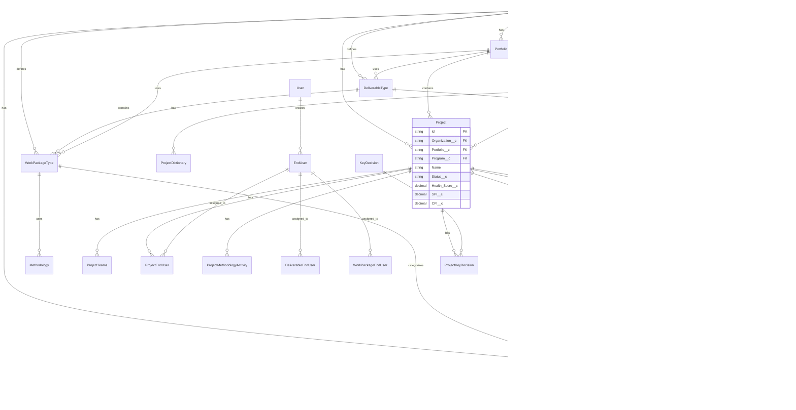

#### Sample Questions for This Domain

| Question | Required Objects | Query Pattern |
|----------|-----------------|---------------|
| "How is Project X doing?" | Project | `SELECT Id, Name, amigo1__Health_Score__c, amigo1__SPI__c, amigo1__CPI__c FROM amigo1__Project__c WHERE Name LIKE '%X%'` |
| "What deliverables are due this month?" | Deliverable | `SELECT Id, Name, amigo1__Due_Date__c FROM amigo1__Deliverable__c WHERE amigo1__Due_Date__c = THIS_MONTH` |
| "List work packages for Project Y" | Work_Package, Project | `SELECT Id, Name, amigo1__Status__c FROM amigo1__Work_Package__c WHERE amigo1__Project__r.Name LIKE '%Y%'` |
| "What is the gate status for Program Z?" | Gate, Gate_Metrics_and_Results | `SELECT Id, Name, amigo1__Status__c, (SELECT amigo1__Result__c FROM amigo1__Gate_Metrics_and_Results__r) FROM amigo1__Gate__c WHERE amigo1__Program__r.Name LIKE '%Z%'` |

---

### DC-05: Risk, Issue & Decision Management (RAID)

**Priority:** High | **Objects:** 11 | **Trigger Keywords:** risk, issue, decision, severity, probability, impact, mitigation, escalation

#### Objects in This Domain

| API Name | Label | Description |
|----------|-------|-------------|
| `amigo1__Risk_Register__c` | Risk Registers | Risk tracking and management |
| `amigo1__Risk_Register_Deliverable__c` | Risk Register Deliverable | Risks linked to deliverables |
| `amigo1__Risk_Register_Object__c` | Risk Register Object | Risks linked to objects |
| `amigo1__Risk_Register_Project__c` | Risk Register Project | Risks linked to projects |
| `amigo1__Issue_Log__c` | Issue Log | Issue tracking and resolution |
| `amigo1__Object_Issue_Log__c` | Object Issue Log | Issues linked to objects |
| `amigo1__Deliverables_Issue_Log__c` | Deliverables Issue Log | Issues linked to deliverables |
| `amigo1__Projects_Issue_Log__c` | Projects Issue Log | Issues linked to projects |
| `amigo1__Key_Decision__c` | Key Decision | Decision tracking and management |
| `amigo1__Deliverable_For_Key_Decisions__c` | Deliverable For Key Decisions | Decisions linked to deliverables |
| `amigo1__Object_Key_Decision__c` | Object Key Decision | Decisions linked to objects |

#### Relationship Diagram

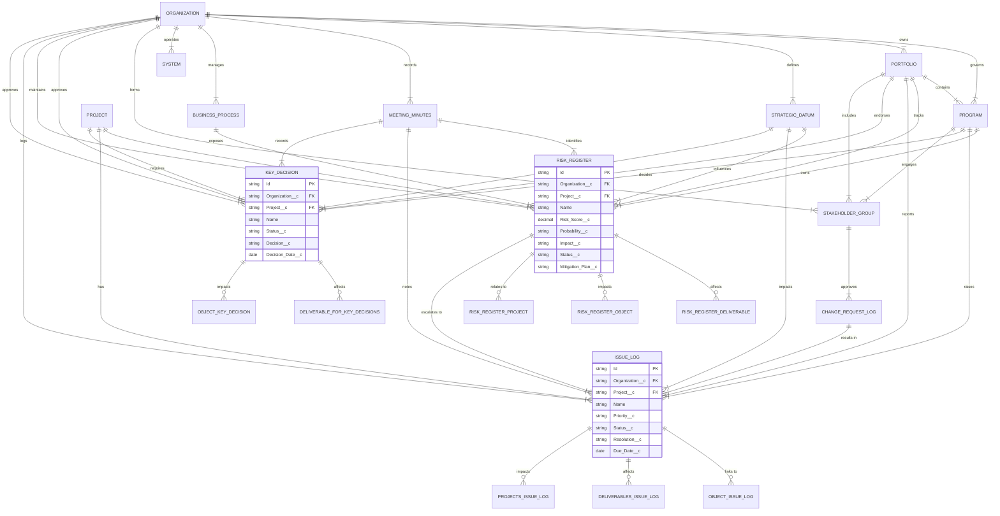

#### Sample Questions for This Domain

| Question | Required Objects | Query Pattern |
|----------|-----------------|---------------|
| "What are the top 3 risks for Project X?" | Risk_Register | `SELECT Id, Name, amigo1__Risk_Score__c, amigo1__Impact__c FROM amigo1__Risk_Register__c WHERE amigo1__Project__r.Name LIKE '%X%' ORDER BY amigo1__Risk_Score__c DESC LIMIT 3` |
| "What issues are critical and open?" | Issue_Log | `SELECT Id, Name, amigo1__Priority__c, amigo1__Due_Date__c FROM amigo1__Issue_Log__c WHERE amigo1__Priority__c = 'Critical' AND amigo1__Status__c != 'Closed'` |
| "What decisions need my attention?" | Key_Decision | `SELECT Id, Name, amigo1__Status__c, amigo1__Due_Date__c FROM amigo1__Key_Decision__c WHERE amigo1__Status__c = 'Pending' AND amigo1__Owner__c = :userId` |
| "Show risks that have escalated to issues" | Risk_Register, Issue_Log | `SELECT Id, Name FROM amigo1__Issue_Log__c WHERE amigo1__Risk_Register__c != null` |

---

### DC-06: Action & Change Management

**Priority:** High | **Objects:** 6 | **Trigger Keywords:** action, change request, lesson learned, approval, status

#### Objects in This Domain

| API Name | Label | Description |
|----------|-------|-------------|
| `amigo1__Action_Items__c` | Action Items | Tasks to be completed |
| `amigo1__Objects_Action_Item__c` | Objects Action Item | Actions linked to objects |
| `amigo1__Change_Request_Log__c` | Change Request Log | Change request tracking |
| `amigo1__Change_Request_Business_Transaction__c` | Change Request Business Transaction | Change requests for business transactions |
| `amigo1__ObjectChangeRequest__c` | ObjectChangeRequest | Change requests for objects |
| `amigo1__Lessons_Learned__c` | Lessons Learned | Captured learnings from projects |

#### Relationship Diagram

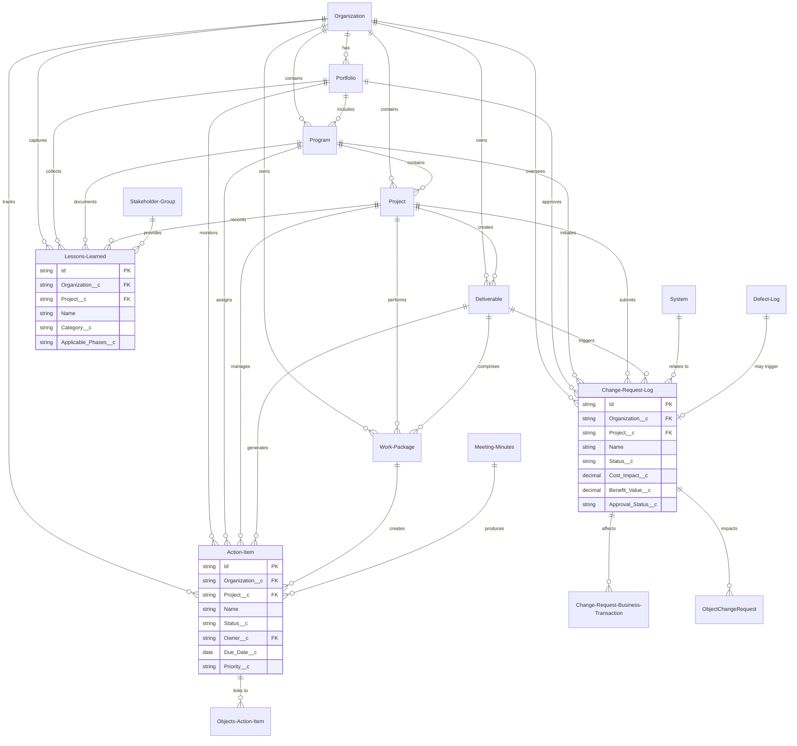

#### Sample Questions for This Domain

| Question | Required Objects | Query Pattern |
|----------|-----------------|---------------|
| "What action items are overdue?" | Action_Items | `SELECT Id, Name, amigo1__Due_Date__c, amigo1__Owner__r.Name FROM amigo1__Action_Items__c WHERE amigo1__Due_Date__c < TODAY AND amigo1__Status__c != 'Completed'` |
| "What change requests are pending approval?" | Change_Request_Log | `SELECT Id, Name, amigo1__Cost_Impact__c, amigo1__Status__c FROM amigo1__Change_Request_Log__c WHERE amigo1__Approval_Status__c = 'Pending'` |
| "What lessons have we learned on Program X?" | Lessons_Learned | `SELECT Id, Name, amigo1__Category__c FROM amigo1__Lessons_Learned__c WHERE amigo1__Program__r.Name LIKE '%X%'` |

---

### DC-07: Resource & RACI Management

**Priority:** High | **Objects:** 9 | **Trigger Keywords:** resource, RACI, responsible, accountable, consulted, informed, assigned, capacity, utilization

#### Objects in This Domain

| API Name | Label | Description |
|----------|-------|-------------|
| `amigo1__Role_Recource__c` | Resources | Team member resources |
| `amigo1__Workstream_Role__c` | Roles | Role definitions |
| `amigo1__Workstream_Project_team_Role_Member__c` | Workstream Role | Role assignments in workstreams |
| `amigo1__Workstream_Role_Resources__c` | Workstream Role Resources | Resources assigned to roles |
| `amigo1__RACI_Chart__c` | RACI Chart | Responsibility assignment matrix |
| `amigo1__RACI_Chart_Extension__c` | RACI Charts | Extended RACI tracking |
| `amigo1__End_User__c` | End User | Business end users |
| `amigo1__Organizational_Other_User__c` | Organizational Other User | Other user types |
| `User` | User (Standard) | Salesforce standard User object |

#### Relationship Diagram

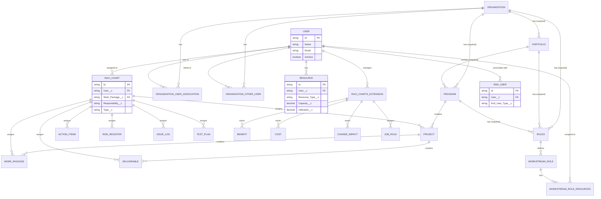

#### Critical Query Pattern: RACI-Based Queries

> ⚠️ **IMPORTANT**: For ANY query about resource assignments, work package assignments, or "how many X does Y have", ALWAYS use the RACI Chart object!

```sql
-- CORRECT: Find work packages assigned to a user
SELECT Id, Name 
FROM amigo1__Work_Package__c 
WHERE Id IN (
    SELECT amigo1__Work_Package__c 
    FROM amigo1__RACI_Chart__c 
    WHERE amigo1__User__r.Name LIKE '%John%'
)

-- WRONG: Don't try to query Work_Package directly for user assignments
-- Work packages don't have a direct User lookup field!
```

#### Sample Questions for This Domain

| Question | Required Objects | Query Pattern |
|----------|-----------------|---------------|
| "How many work packages does John have?" | RACI_Chart, Work_Package | `SELECT Id, Name FROM amigo1__Work_Package__c WHERE Id IN (SELECT amigo1__Work_Package__c FROM amigo1__RACI_Chart__c WHERE amigo1__User__r.Name LIKE '%John%')` |
| "Who is responsible for Deliverable X?" | RACI_Chart, User | `SELECT amigo1__User__r.Name, amigo1__Responsibility__c FROM amigo1__RACI_Chart__c WHERE amigo1__Deliverable__r.Name LIKE '%X%'` |
| "What is the resource utilization for Program Y?" | Resource, Program | `SELECT amigo1__User__r.Name, amigo1__Utilization__c FROM amigo1__Role_Recource__c WHERE amigo1__Program__r.Name LIKE '%Y%'` |

---

### DC-08: Work Stream & Methodology

**Priority:** Medium | **Objects:** 10 | **Trigger Keywords:** workstream, methodology, activity, predecessor, successor

#### Objects in This Domain

| API Name | Label | Description |
|----------|-------|-------------|
| `amigo1__Work_Stream__c` | Work Streams | Functional work streams |
| `amigo1__Work_Stream_Activity__c` | Work Stream Activity | Activities within work streams |
| `amigo1__Predecessor_Work_Stream__c` | Predecessor Work Stream | Work stream dependencies |
| `amigo1__Successor_Work_Streams__c` | Successor Work Streams | Work stream successors |
| `amigo1__Methodology__c` | Methodology | Implementation methodologies |
| `amigo1__Methodology_Activity_Group__c` | Methodology Activity Group | Groups of methodology activities |
| `amigo1__Methodology_Activity__c` | Methodology Activity | Individual methodology activities |
| `amigo1__Predecessor_Methodology_Activity__c` | Predecessor Methodology Activity | Activity dependencies |
| `amigo1__Successor_Methodology_Activity__c` | Successor Methodology Activity | Activity successors |
| `amigo1__Methodology_Accelerators__c` | Methodology Leading Practice/Accelerator | Best practices and accelerators |

#### Relationship Diagram

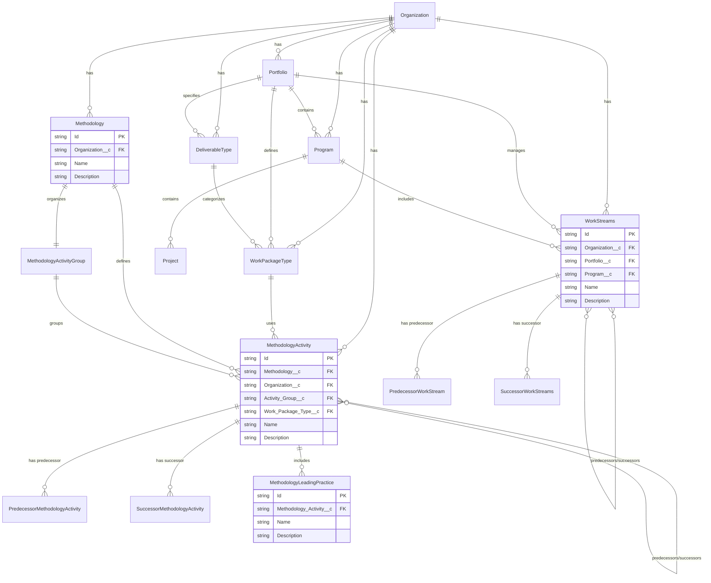

---

### DC-09: Business Process & Job Role Management

**Priority:** Medium | **Objects:** 12 | **Trigger Keywords:** business process, job role, security profile, L1, L2, L3, L4, L5

#### Objects in This Domain

| API Name | Label | Description |
|----------|-------|-------------|
| `amigo1__Business_Process__c` | Business Process | Business process definitions (L1-L5) |
| `amigo1__Business_Process_Master_List__c` | Business Process Master List | Master list of processes |
| `amigo1__Business_Process_Measures_MetricJunction__c` | Business Process | Process-metric junctions |
| `amigo1__Business_Process_Job_Role__c` | Business Process Job Role | Job roles for processes |
| `amigo1__Predecessor_Business_Process__c` | Predecessor Business Process | Process dependencies |
| `amigo1__Successor_Business_Process__c` | Successor Business Process | Process successors |
| `amigo1__Job_Role__c` | Job Role | Job role definitions |
| `amigo1__Job_Role_End_User__c` | Job Role End User | End users for job roles |
| `amigo1__Job_Security_Profile__c` | Job Security Profile | Security profiles for jobs |
| `amigo1__Datum_Job_Role__c` | Datum Job Role | Data-job role associations |
| `amigo1__Security_Profile__c` | Security Profile | Security profile definitions |
| `amigo1__Security_Profile_Business_Process__c` | Security Profile Business Transaction | Security for business transactions |

#### Relationship Diagram

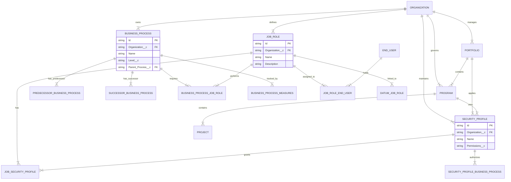

---

### DC-10: Data Management & Migration

**Priority:** Medium | **Objects:** 14 | **Trigger Keywords:** data, migration, mapping, cleansing, quality, ETL, source, target

#### Objects in This Domain

| API Name | Label | Description |
|----------|-------|-------------|
| `amigo1__Data_Domain__c` | Data Domain | Data domain categories |
| `amigo1__Data_Store__c` | Data Table | Data tables/entities |
| `amigo1__Data_Store_Element__c` | Data Field | Data fields/columns |
| `amigo1__Data_Asset_Group__c` | Data Asset Group | Groupings of data assets |
| `amigo1__Data_Mapping_Register__c` | Data Mapping Register | Source-to-target mappings |
| `amigo1__Data_Mapping_Rules__c` | Data Mapping Rules | Transformation rules |
| `amigo1__Data_Cleansing_Tracker__c` | Data Cleansing Tracker | Data cleansing progress |
| `amigo1__Data_Cleansing_Tracker_Metrics__c` | Data Cleansing Tracker Metrics | Cleansing metrics |
| `amigo1__Data_Migration_Execution_Statistics__c` | Data Migration Execution Statistics | Migration run statistics |
| `amigo1__Data_Migration_Execution_Stat_Details__c` | Data Migration Execution Stat Details | Detailed migration stats |
| `amigo1__Data_Quality_Rule__c` | Data Quality Rule | Quality validation rules |
| `amigo1__Rules_and_Requirements__c` | Rules and Requirements | Business rules |
| `amigo1__Rules_to_Data_Map__c` | Rules to Data Map | Rules mapped to data |
| `amigo1__Rules_to_Work_Packages__c` | Rules to Work Packages | Rules mapped to work packages |

#### Relationship Diagram

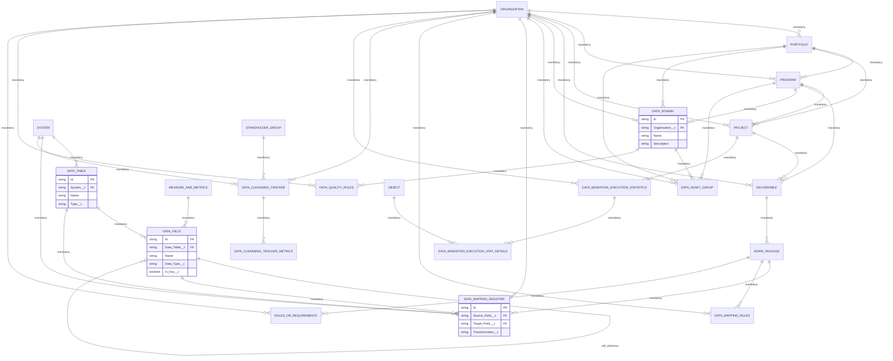

---

### DC-11: Testing & Quality Management

**Priority:** Medium | **Objects:** 10 | **Trigger Keywords:** test, scenario, case, step, defect, quality, UAT, SIT

#### Objects in This Domain

| API Name | Label | Description |
|----------|-------|-------------|
| `amigo1__Test_Plan__c` | Test Plan | Test planning and management |
| `amigo1__Test_Plan_Details__c` | Test Plan Detail | Detailed test plan items |
| `amigo1__Test_Scenario__c` | Test Scenario | Test scenario definitions |
| `amigo1__Test_Case__c` | Test Case | Individual test cases |
| `amigo1__Test_Step__c` | Test Step | Test execution steps |
| `amigo1__Test_Component__c` | Test Component | Reusable test components |
| `amigo1__Test_Step_Data_Mapping_Register__c` | Test Step Data Mapping Register | Data mappings for test steps |
| `amigo1__Test_Step_Rules_And_Requirements__c` | Test Step Rules And Requirement | Rules for test steps |
| `amigo1__Object_Test_Plan__c` | Object Test Plan | Test plans for objects |
| `amigo1__Defect_Log__c` | Defect Log | Defect tracking |

#### Relationship Diagram

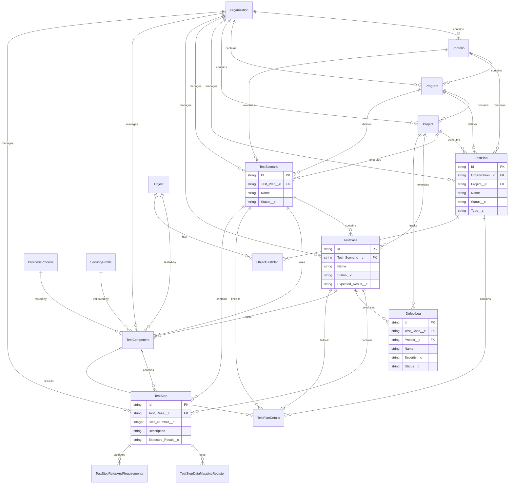

---

### DC-12: Cutover & Go-Live Management

**Priority:** Medium | **Objects:** 7 | **Trigger Keywords:** cutover, go-live, environment, baseline, deployment

#### Objects in This Domain

| API Name | Label | Description |
|----------|-------|-------------|
| `amigo1__Cutover_Deliverable__c` | Cutover Plan | Cutover planning |
| `amigo1__Cutover_Task__c` | Cutover Task | Individual cutover tasks |
| `amigo1__Cutover_Event_Journal__c` | Cutover Event Journal | Event logging during cutover |
| `amigo1__Cutover_Plan_Change_Request__c` | Cutover Plan Change Request | Changes to cutover plans |
| `amigo1__Baseline_Cutover_Data__c` | Baseline Cutover Data | Baseline data for cutover |
| `amigo1__Environment__c` | Environment | Deployment environments |
| `amigo1__Object_Environment__c` | Object Environment | Objects in environments |

#### Relationship Diagram

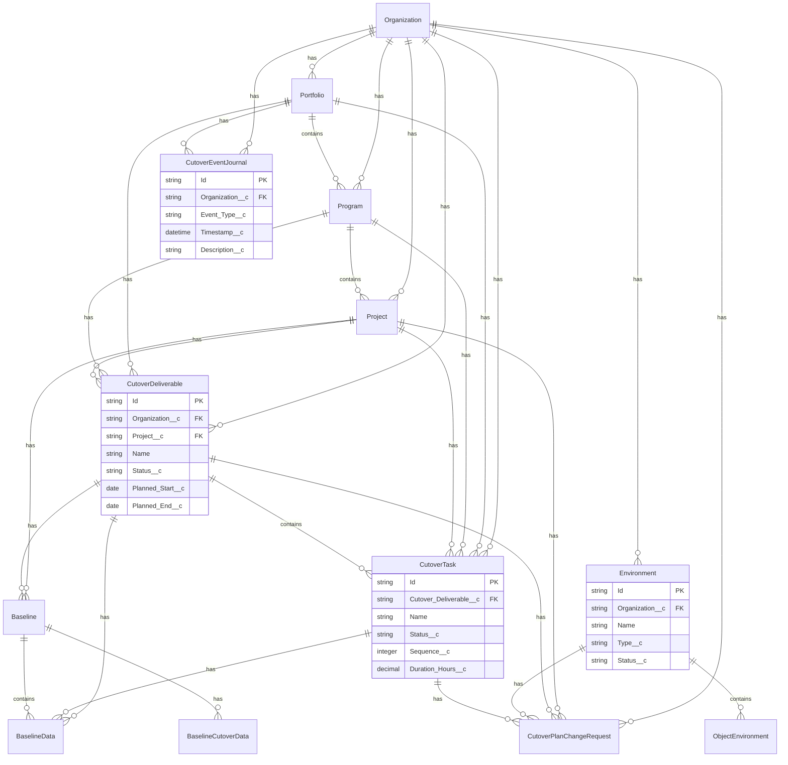

---

### DC-13: Benefits & Financial Tracking

**Priority:** Medium | **Objects:** 11 | **Trigger Keywords:** benefit, cost, expense, ROI, financial, budget, tracking

#### Objects in This Domain

| API Name | Label | Description |
|----------|-------|-------------|
| `amigo1__Benefit__c` | Benefit | Benefit definitions |
| `amigo1__Benefits_Tracking_Detail__c` | Benefits Tracking Detail | Benefit realization tracking |
| `amigo1__Benefit_Process__c` | Benefit Process | Benefits linked to processes |
| `amigo1__Benefit_Deliverable__c` | Benefit Deliverable | Benefits linked to deliverables |
| `amigo1__Datum_Benefit__c` | Datum Benefit | Data-benefit associations |
| `amigo1__Cost__c` | Cost | Cost tracking |
| `amigo1__Cost_Tracking_Detail__c` | Cost Tracking Detail | Detailed cost tracking |
| `amigo1__Cost_Rate_Table__c` | Cost Rate Table | Cost rate definitions |
| `amigo1__Billing_Rate_Table__c` | Billing Rate Table | Billing rate definitions |
| `amigo1__Expense_Report__c` | Expense Report | Expense reporting |
| `amigo1__Expense_Tracking__c` | Expense Tracking | Expense tracking details |

#### Relationship Diagram

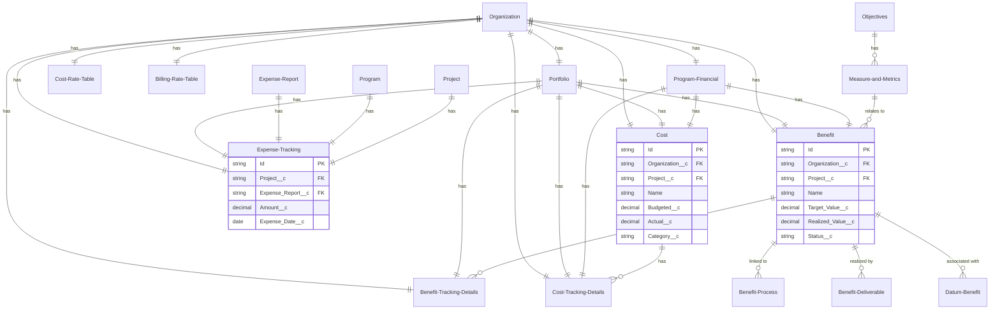

---

### DC-14: Communication & Collaboration

**Priority:** Low | **Objects:** 9 | **Trigger Keywords:** communication, stakeholder, meeting, change impact, OCM

#### Objects in This Domain

| API Name | Label | Description |
|----------|-------|-------------|
| `amigo1__Communications_Register__c` | Communications Register | Communication planning |
| `amigo1__Communication_Stakeholder__c` | Communication Stakeholder | Stakeholders for communications |
| `amigo1__Stakeholder_Groups__c` | Stakeholder Group | Stakeholder group definitions |
| `amigo1__Datum_Stakeholder_Group__c` | Datum Stakeholder Group | Data-stakeholder associations |
| `amigo1__Change_Impact_Assessment__c` | Change Impact Assessment | Change impact analysis |
| `amigo1__Change_Impact_Stakeholder_Group__c` | Change Impact Stakeholder Group | Stakeholders affected by changes |
| `amigo1__Meeting_Minutes__c` | Meeting Minutes | Meeting documentation |
| `amigo1__Attendees_and_absentees__c` | Attendees and absentees | Meeting attendance tracking |
| `amigo1__Watch_List__c` | Watch List | Items being monitored |

#### Relationship Diagram

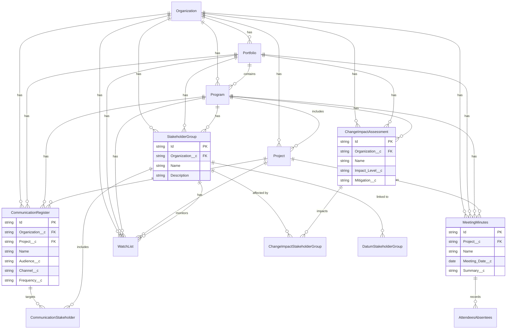

---

## 4. Cross-Domain Relationship Matrix

This matrix shows how Domain Contexts connect to each other through shared objects.

| From Domain | To Domain | Connection Objects | Relationship Type |
|-------------|-----------|-------------------|-------------------|
| DC-01 | DC-02 | Organization, Portfolio | Parent-Child |
| DC-01 | DC-03 | Organization, Portfolio, Program | Parent-Child |
| DC-02 | DC-03 | Program, Project | Parent-Child |
| DC-03 | DC-04 | Project, Deliverable | Parent-Child |
| DC-04 | DC-05 | Deliverable, Work_Package | Links to RAID |
| DC-03 | DC-05 | Project | Risk/Issue/Decision Owner |
| DC-05 | DC-06 | Issue_Log, Change_Request | Escalation |
| DC-07 | DC-04 | RACI_Chart, Work_Package | Assignment |
| DC-07 | DC-05 | RACI_Chart, Risk/Issue | Ownership |
| DC-08 | DC-04 | Methodology_Activity, Work_Package_Type | Template |
| DC-09 | DC-11 | Business_Process, Test_Component | Testing |
| DC-10 | DC-11 | Data_Mapping_Register, Test_Step | Validation |
| DC-11 | DC-05 | Defect_Log, Issue_Log | Escalation |
| DC-12 | DC-03 | Cutover_Plan, Project | Deployment |
| DC-13 | DC-01 | Benefit, Objectives | Tracking |
| DC-14 | DC-05 | Stakeholder_Group, Change_Request | Approval |

---

## 5. Query Generation Guidelines

### 5.1 Critical Rules

1. **Never use COUNT() for "How many" questions**
   - Always retrieve records and count programmatically
   - Wrong: `SELECT COUNT() FROM amigo1__Work_Package__c`
   - Correct: `SELECT Id, Name FROM amigo1__Work_Package__c`

2. **Use LIKE for name searches**
   - Always use wildcards for flexible matching
   - Pattern: `WHERE Name LIKE '%SearchTerm%'`

3. **Use RACI_Chart for resource queries**
   - Any query about "assigned to", "who has", "how many does X have"
   - Always join through RACI_Chart, not direct lookup

4. **Respect the hierarchy**
   - Always filter by Organization first when applicable
   - Use relationship queries to traverse hierarchy

### 5.2 Query Type Selection

| User Intent | Query Type | Example Keywords |
|-------------|-----------|------------------|
| Retrieve specific records | SOQL | "get", "show", "list", "what is" |
| Search across objects | SOSL | "find", "search", "lookup" |
| Aggregate/analyze | SOQL with relationships | "how many", "total", "compare" |
| Generate content | Conversational | "write", "create", "help me" |

### 5.3 Common Query Patterns

```sql
-- Pattern 1: Hierarchy traversal
SELECT Id, Name, amigo1__Program__r.Name, amigo1__Program__r.amigo1__Portfolio__r.Name
FROM amigo1__Project__c
WHERE amigo1__Organization__c = :orgId

-- Pattern 2: RACI-based assignment query
SELECT Id, Name 
FROM amigo1__Work_Package__c 
WHERE Id IN (
    SELECT amigo1__Work_Package__c 
    FROM amigo1__RACI_Chart__c 
    WHERE amigo1__User__r.Name LIKE '%John%'
)

-- Pattern 3: Risk analysis
SELECT Id, Name, amigo1__Risk_Score__c, amigo1__Impact__c, amigo1__Probability__c
FROM amigo1__Risk_Register__c
WHERE amigo1__Project__r.Name LIKE '%ProjectX%'
ORDER BY amigo1__Risk_Score__c DESC
LIMIT 5

-- Pattern 4: Health dashboard
SELECT Id, Name, amigo1__Health_Score__c, amigo1__SPI__c, amigo1__CPI__c,
    (SELECT Id, Name, amigo1__Status__c FROM amigo1__Risk_Registers__r WHERE amigo1__Status__c = 'Open'),
    (SELECT Id, Name, amigo1__Status__c FROM amigo1__Issue_Logs__r WHERE amigo1__Status__c = 'Open')
FROM amigo1__Project__c
WHERE amigo1__Program__r.Name LIKE '%ProgramY%'
```

---

## 6. Appendix: Complete Object Reference

### All 147 AMIGO Objects by API Name

| # | API Name | Label | Domain Context |
|---|----------|-------|----------------|
| 1 | `amigo1__Organization__c` | Organization | DC-01 |
| 2 | `amigo1__Portfolio__c` | Portfolio | DC-01 |
| 3 | `amigo1__Portfolio_Evaluation_Request__c` | Portfolio Evaluation Request | DC-01 |
| 4 | `amigo1__Portfolio_User_Association__c` | Portfolio User Association | DC-01 |
| 5 | `amigo1__Portfolio_Evaluator__c` | Portfolio Evaluator | DC-01 |
| 6 | `amigo1__User_Association__c` | Organization User Association | DC-01 |
| 7 | `amigo1__Goals__c` | Goals | DC-01 |
| 8 | `amigo1__Objectives__c` | Objectives | DC-01 |
| 9 | `amigo1__Measures_and_Metrics__c` | Measures and Metrics | DC-01 |
| 10 | `amigo1__Program__c` | Program | DC-02 |
| 11 | `amigo1__Program_Financial__c` | Program Financial | DC-02 |
| 12 | `amigo1__Program_User_Association__c` | Program User Association | DC-02 |
| 13 | `amigo1__Program_Dictionary__c` | Program Dictionary | DC-02 |
| 14 | `amigo1__Program_Evaluation_Score__c` | Program Evaluation Score | DC-02 |
| 15 | `amigo1__Domain_Program__c` | Domain Program | DC-02 |
| 16 | `amigo1__Datum_Program__c` | Datum Program | DC-02 |
| 17 | `amigo1__Project__c` | Project | DC-03 |
| 18 | `amigo1__Project_Dictonary__c` | Project Dictionary | DC-03 |
| 19 | `amigo1__Project_Teams__c` | Project Team | DC-03 |
| 20 | `amigo1__Project_End_User__c` | Project End User | DC-03 |
| 21 | `amigo1__Project_Methodology_Activity__c` | Project Methodology Activity | DC-03 |
| 22 | `amigo1__Project_Key_Decision__c` | Project Key Decision | DC-03 |
| 23 | `amigo1__Gate__c` | Gate | DC-03 |
| 24 | `amigo1__Gate_Metrics_and_Results__c` | Gate Metrics and Results | DC-03 |
| 25 | `amigo1__Deliverable__c` | Deliverable | DC-04 |
| 26 | `amigo1__Deliverable_Type__c` | Deliverable Type | DC-04 |
| 27 | `amigo1__Deliverable_End_User__c` | Deliverable End User | DC-04 |
| 28 | `amigo1__Work_Package__c` | Work Package | DC-04 |
| 29 | `amigo1__Work_Package_Type__c` | Work Package Type | DC-04 |
| 30 | `amigo1__Work_Package_End_User__c` | Work Package End User | DC-04 |
| 31 | `amigo1__Work_Package_Type_Estimate__c` | Work Package Type Estimate | DC-04 |
| 32 | `amigo1__Risk_Register__c` | Risk Registers | DC-05 |
| 33 | `amigo1__Risk_Register_Deliverable__c` | Risk Register Deliverable | DC-05 |
| 34 | `amigo1__Risk_Register_Object__c` | Risk Register Object | DC-05 |
| 35 | `amigo1__Risk_Register_Project__c` | Risk Register Project | DC-05 |
| 36 | `amigo1__Issue_Log__c` | Issue Log | DC-05 |
| 37 | `amigo1__Object_Issue_Log__c` | Object Issue Log | DC-05 |
| 38 | `amigo1__Deliverables_Issue_Log__c` | Deliverables Issue Log | DC-05 |
| 39 | `amigo1__Projects_Issue_Log__c` | Projects Issue Log | DC-05 |
| 40 | `amigo1__Key_Decision__c` | Key Decision | DC-05 |
| 41 | `amigo1__Deliverable_For_Key_Decisions__c` | Deliverable For Key Decisions | DC-05 |
| 42 | `amigo1__Object_Key_Decision__c` | Object Key Decision | DC-05 |
| 43 | `amigo1__Action_Items__c` | Action Items | DC-06 |
| 44 | `amigo1__Objects_Action_Item__c` | Objects Action Item | DC-06 |
| 45 | `amigo1__Change_Request_Log__c` | Change Request Log | DC-06 |
| 46 | `amigo1__Change_Request_Business_Transaction__c` | Change Request Business Transaction | DC-06 |
| 47 | `amigo1__ObjectChangeRequest__c` | ObjectChangeRequest | DC-06 |
| 48 | `amigo1__Lessons_Learned__c` | Lessons Learned | DC-06 |
| 49 | `amigo1__Role_Recource__c` | Resources | DC-07 |
| 50 | `amigo1__Workstream_Role__c` | Roles | DC-07 |
| 51 | `amigo1__Workstream_Project_team_Role_Member__c` | Workstream Role | DC-07 |
| 52 | `amigo1__Workstream_Role_Resources__c` | Workstream Role Resources | DC-07 |
| 53 | `amigo1__RACI_Chart__c` | RACI Chart | DC-07 |
| 54 | `amigo1__RACI_Chart_Extension__c` | RACI Charts | DC-07 |
| 55 | `amigo1__End_User__c` | End User | DC-07 |
| 56 | `amigo1__Organizational_Other_User__c` | Organizational Other User | DC-07 |
| 57 | `User` | User (Standard) | DC-07 |
| 58 | `amigo1__Work_Stream__c` | Work Streams | DC-08 |
| 59 | `amigo1__Work_Stream_Activity__c` | Work Stream Activity | DC-08 |
| 60 | `amigo1__Predecessor_Work_Stream__c` | Predecessor Work Stream | DC-08 |
| 61 | `amigo1__Successor_Work_Streams__c` | Successor Work Streams | DC-08 |
| 62 | `amigo1__Methodology__c` | Methodology | DC-08 |
| 63 | `amigo1__Methodology_Activity_Group__c` | Methodology Activity Group | DC-08 |
| 64 | `amigo1__Methodology_Activity__c` | Methodology Activity | DC-08 |
| 65 | `amigo1__Predecessor_Methodology_Activity__c` | Predecessor Methodology Activity | DC-08 |
| 66 | `amigo1__Successor_Methodology_Activity__c` | Successor Methodology Activity | DC-08 |
| 67 | `amigo1__Methodology_Accelerators__c` | Methodology Leading Practice/Accelerator | DC-08 |
| 68-147 | *(Remaining objects...)* | *(See full list in DC-09 through DC-15)* | DC-09 to DC-15 |

---

## Document Control

| Version | Date | Author | Changes |
|---------|------|--------|---------|
| 1.0 | January 2026 | WBE Consultants LLC | Initial creation |

---

> *Build with purpose. Deliver value with pride.*
> 
> **— The AMIGO Team**